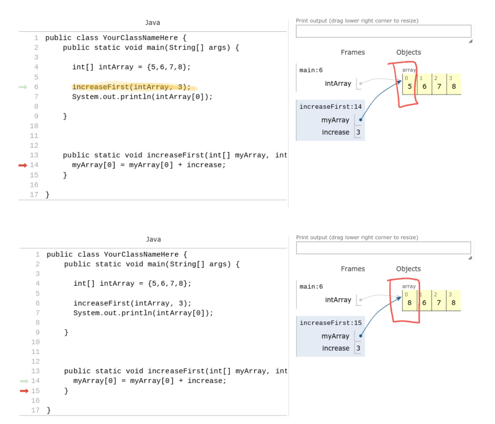

# Arrays and Methods

## Arrays as parameters
When passing an array as a parameter to a method, you are passing a reference to the array, therefore, the parameter variable in the method points to the same array as the calling program.

In the image below, the `sumArray` method computes the sum of the given array.  Notice that when executing `sumArray`, the parameter variable myArray points to the same array as the intArray variable.

```
public class Problem1 extends ConsoleProgram {
    public void run() {
    
    int[] intArray = {5,6,7,8};
    
    int sum = sumArray(intArray);
    
    System.out.println(sum);
    }
    
    public int sumArray(int[] myArray){
      int total = 0;
      
      for(int i = 0; i < myArray.length; i++){
        total = total + myArray[i];
      }
      
      return total;
    }     
}
```


## Modifying an array within a method
Since arrays are passed as a reference, making changes to the parameter array will affect the array at the calling program

```
public class Program2 extends ConsoleProgram {
    public void run() {
    
      int[] intArray = {5,6,7,8}; 

      increaseFirst(intArray, 3);
      System.out.println(intArray[0]);
      
    }
    
    public void increaseFirst(int[] myArray, int increase){
      myArray[0] = myArray[0] + increase;    
    }
    
}
```


## Arrays as Return values
We can also form arrays in a method and return them.  

### Example
Write a method firstLast that returns an array consisting of the first and last elements of the parameter fullArray.  Write a main program to test it.

```
public class Program3 extends ConsoleProgram{
    public void run() {
    
      int[] fullArray = {5,6,7,8}; 
      
      int[] newArray = firstLast(fullArray);
      
    }
    
    public int[] firstLast(int[] fullArray){
      int[] result = new int[2];
      
      result[0] = fullArray[0];
      result[1] = fullArray[fullArray.length - 1];
      
      return result;
    }
    
}


